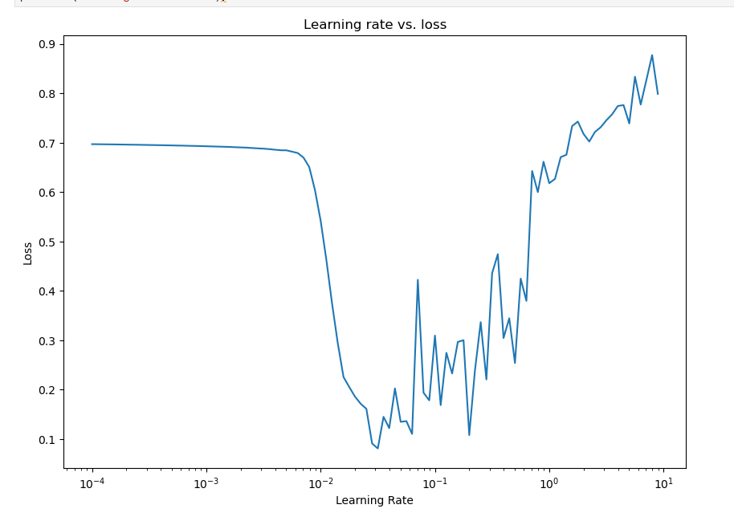

# Deep Learning Training

## General Information
For general information see 01_ANN

Problem of overfitting -> we have a Model which represents the training data very good but does not generalize to new test data. 

-> Good to know: **!** in front of a line is a cmd - line command prefix in Jypiter

# 02_Introduction to TF
import tensorflow as tf

#### Create variables
**Constants**: 
scalar = tf.constant(7)
mat = tf.constant([[1,2],[3,4]])
and functions like in numpy

**Random Numbers**: more or less same API as in numpy

Indexing is also exactly the same as in numpy

#### Basic Tensor Operations
Works just like in numpy 
+10 adds 10 to every element 

Matmul: @ used (same as matmul) -> Inner dimensions (b,c) must match!
(a,b) @ (c,d)

@ is way more efficient!!!!!

#### Aggregation methods: 
reduce_min/max/etc.

# 04 NN intro
Using TensorFlow we always have these three basic steps to work through
- Create a Model
- Compile a model
- Fit a model!

model = tf.keras.Sequential # sequential API to setup model

model.compile(lossfunction, optimizer, metrics=[list to be shown in output])

for model.fit where we fit our model we may have to exapnd_dims (one ghost dimension).

# Pandas good to know
#### One hot encoding
pd.get_dummies(df, drop_first=False)
drop_first -> to drop one of the cats

# Feature Scaling
Features should be scaled using a tranformer to the 0-1 range (normalized)
-> Make sure that you only transform Training Data to not influence Testdata!

# Callbacks
Callbacks can be used to hook into different training stages!

-> use https://wandb.ai/ Weights and Biases instead of callbacks

Choose the learning rate such that the change in loss is maximum -> meaning 10^-2 in this example

# ML & DeepL -> Hands-On Machinelearning Book

**Look at 09_conf matrices** -> there are nice visualizations of different ways to confusion mat. 

# ImageDataGenerator - to generate train/test data directly from directories